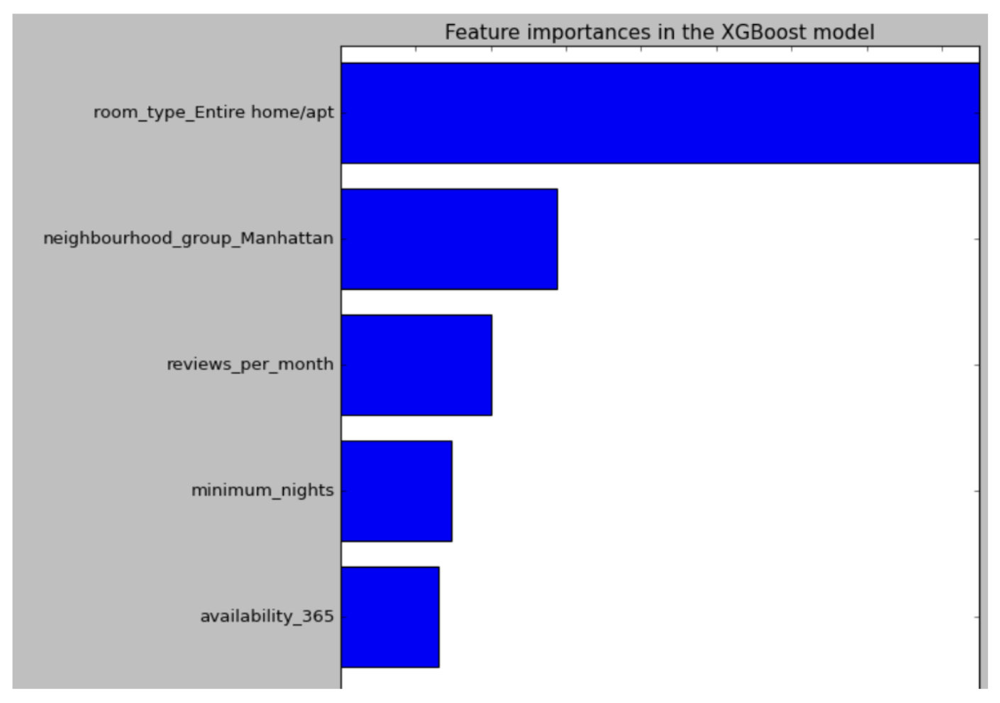
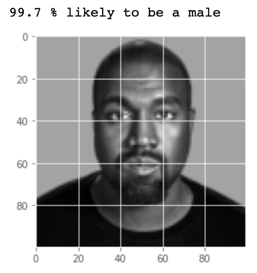
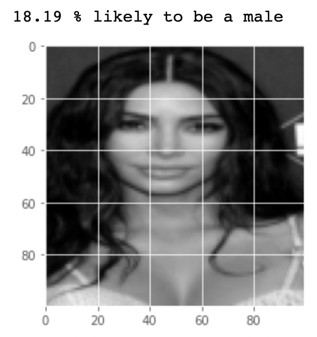
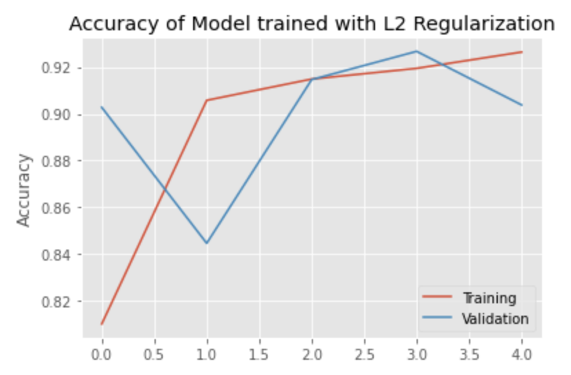
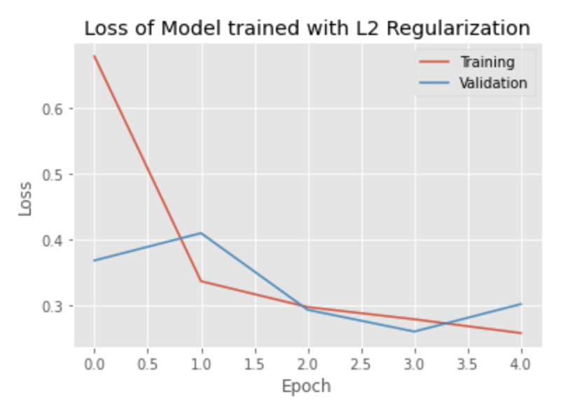
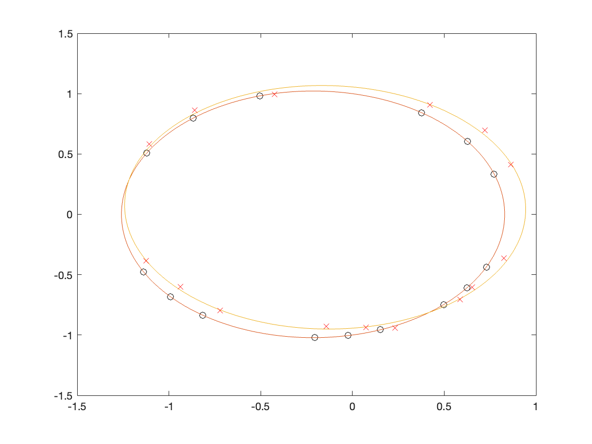

# [Project 1: AirBnb NYC Data Analysis, Quote, and Recommendation system](https://github.com/amayk13/Airbnb-and-CDC-projects)

- Data visualizations using Seaborn library (80+ lines of code). Correlation tables, scatter plots, and boxplots.
- Successful quote system based on 15+ features and XGBoost.
- Interactive map for a recommendation system 

# [Project 2: CDC API Data Analysis and Modeling](https://github.com/amayk13/Airbnb-and-CDC-projects)

- Aggregated and cleaned COVID-19 cases & vaccine data from CDC APIs (5 unique API's)
- Created multiple linear and random forest regression model for predicting allocation (Dose) based on cases, deaths, and population (93% accuracy highest).
- Compared K means, DBScan, and Mean shift models for the best fit.
- Mean shift and DBScan perform the best slightly having an edge over K means.

# [Project 3: CelebFaces - Gender Recognition using Keras](https://github.com/amayk13/CelebFaces-Gender-Recognition)

- Practiced machine learning techniques (RNN, CNN, regression).
- Employed power methods for calculating gradient descent for optimizing functions. 
- Secured A+ on face pattern recognition model (with 90%+ accuracy) 2 Neural Net and Logistic Regression algorithms using Keras.
- Concurrent Neural Net was the best followed by Logistic Regression and Recurrent Neural Net.

# [Project 4: Jeopardy Shiny App (jservice.io)](https://github.com/amayk13/Jeopardy-Shiny-App)

- Inspired by the famous Jeopardy trivia game using open source API.
- Filter through and view popular questions from 100+ questions.
- Use Random mode to pick 10 questions from the database for practice.
- Use Test mode to test yourself against one question with a 30 second timer.

Check out the app!

https://amay-kharbanda.shinyapps.io/7626598f9e634f34bfc58862fa247e05/

# [Project 5: Statistical Analysis of Bank Data](https://github.com/amayk13/Statistical-Analysis-on-Bank-Data)

- Employed 4 algorithms and compared accuracies to predict likelihood of Bank Loan from customers
- LASSO feature selection + Logistic Regression (89.98% accuracy)
- Simple Decision Tree Classification (89.99% accuracy)
- Ensemble Method - Random Forest (90.1% accuracy)
- Neural Net (87.3% accuracy)

# [Project 6: Mapping pluto's orbit and analyzing perturbations](https://github.com/amayk13/Linear-algebra-analysis-on-planetary-system)

- Created data points using NASA’s data set on Heliocentric Trajectories for Selected Spacecraft, Planets, and Comets.
- Efficient code with 65+ lines and employed rigorous Singular Value Decomposition and eigen decomposition algorithms.
- Orbit equation was mapped with 99%+ accuracy.
- Orbit equation was mapped with 94%+ accuracy for perturbed data points.

Plot:

